# Unity Shader Experiments

This repository contains **Unity Shader Graph experiments**.

- **Main branch**: a clean template with minimal setup for testing shaders.  
- **Experiment branches**: individual shader projects based on the main branch.  

Branches can include shaders from tutorials or my own creations. The goal of this repository is to **document my experiments and track your learning progress**.

---

# Dissolve effect!

Followed tutorial but adjusted parts to work with my usecase as the tutorial was for 2D and some equasions just didn't work for me:
https://www.youtube.com/watch?v=HYWaU97-UC4

Its quite a challenge to explain this I'm lucky to say that I already understand basically everything that is going on in this shader so its a good starting point to figuring out how to disect this shader and explain it piece by piece!
Anyway lets get into it, I'm still thinking about how I write these things out, guess I'll figure out my way as I go!
Guess for this one I will first go over the properties of the material and then go over the chain of nodes one at a time and see how it goes!

## Material properties
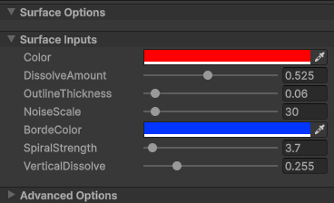

| Property            | Explanation                                                |
|---------------------|------------------------------------------------------------|
| Color               | The base color of the shader                               |
| Noise Scale         | The overall size of the noise pattern                      |
| Dissolve Amount     | How far the shader is dissolved                            |
| Outline Thickness   | How thick the noise-based outline appears                  |
| Border Color        | The color used for the outline/border                      |
| Spiral Strength     | How strongly the noise pattern is warped into a spiral     |
| Vertical Dissolve   | How much the pattern dissolves from top to bottom          |

### Color
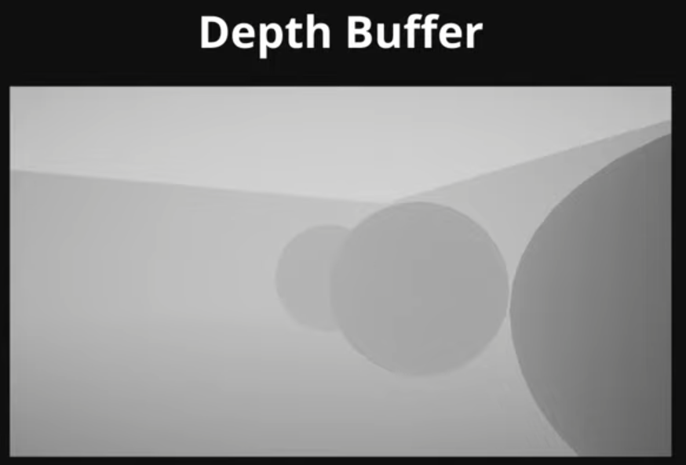
Well color, its just a color picker which is quite simple but soon it'll be more complex! 
I now also realised that I should be taking screenshots as I work through a tutorial or project because getting individual pics is a pain!
But for this one I'll just cut out parts for clearity


### Noise scale 
Alright here is where the fun actually starts!
**NOISE** invented by some kind of handsome greek god (or some crazy math nerd) named Ken Perlin https://mrl.cs.nyu.edu/~perlin/ to make the textures in the movie Tron more realistic.
And this man actually won an oscar with his algorithm and we still use it to this day! Actually the only person to ever improve on this algorithm after it being released, and guess what, It was mr Perlin again releasing "simplex noise"!!!
Anyway I'm getting off track, **NOISE**

Lets implement noise! You might have guessed that holes are slammed into our balls through noise, so what does this mean? Well in simple terms we applied noise to the alpha of our object (alpha is transparency, a value between 0 for nothing and 1 for being completely visible). Noise on its own is basically a different value between 0 and 1, so when we apply this we get a red 3D object with cloudy holes inside, **VERY NICE**

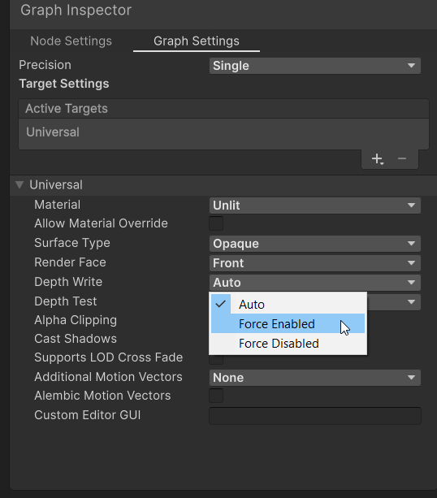
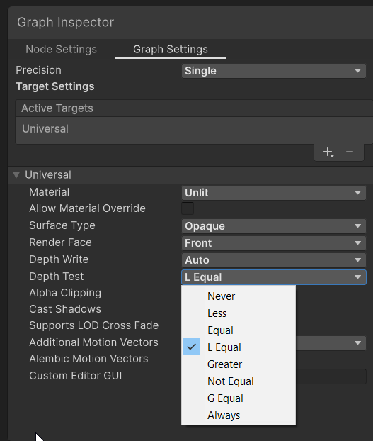

But here is where noise shines in my opinion, so what makes noise interesting class? Lets hear it?
....
"Sir Daan is it because its used everywhere?"
Bro that's not a reason for it being good
"Sir Daan, is it because its random"
Clooseee but how would that be distinguishable from just normal random pixels?
If I would do the calculation y=(sin(x)⋅100000)−⌊sin(x)⋅100000 or in HLSL `y = fract(sin(x) * 100000.0);` or in human language squish tell a sine wave to not go below 0 ans squish it soo hard against eachother that it becomes random dots everywhere I basically have something random too
[Suished sine wave](images/5.png)

No what makes noise very interesting is that the random values aren't entirely random, as you can see in the cloud example it fades meaning the further it gets from the center the lower the alpha value becomes making it more transparent!
Honestly I would love to keep going on how such gradient implementations can implement geomatry and anything in such beautiful ways but I have a readme to finish!
So what does this mean our noise, we know they are basically **Big gradient bubbles**.
Well there is a function named step and it basically cuts off everything under a specific value!

For example, put step on 0.2 and it will only cut out a little bit because everything in the noise that is more white than 0.2 will be completely white, everything below will be black.
Your output will become one or the other, put the treshold way higher and it will allow more black to appear as it needs to be more white to become white.
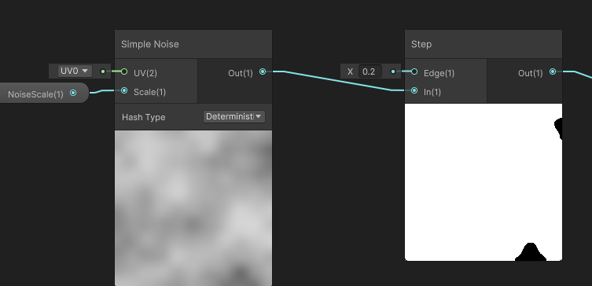


Omfg one thing is that I'm definitly gonna repeat the same explanations to myself again in the future, especially when I already know, I get way to excited....

The result????
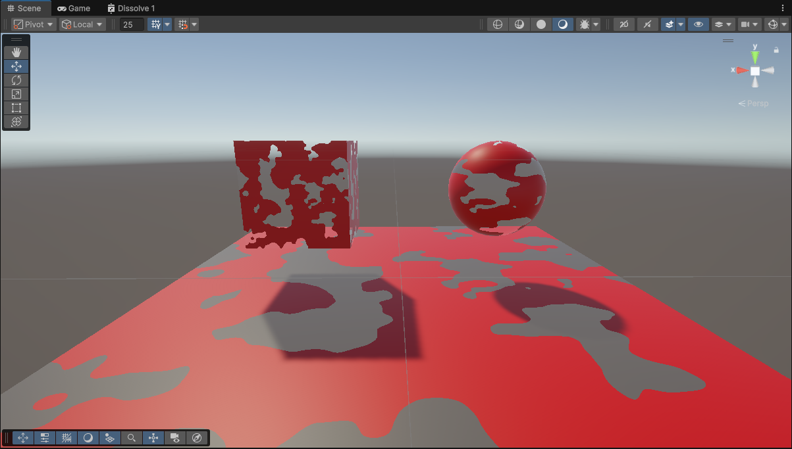
**SMOOOOTTTHHH HOOOLLLLEEESSSSS**

### Dissolve Amount
So we actually already touched on this realier but lets illustrate it for good measure!
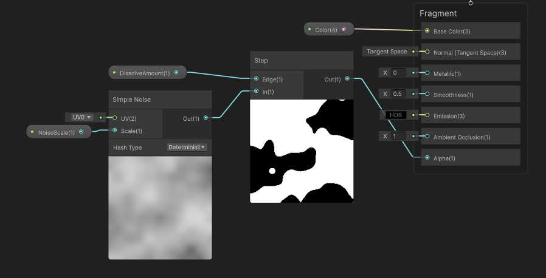
We gave it a parameter! So now instead of "hardcoding" the value you can change it!
As you already know from my explanation earlier **If you paid attention** this does not change the size of the noise but rather how much of the noise that already is there is allowed to matter!!!!!

### Outline thickness
AAAHHHH GOD DAMMIT ITS GETTING LATE BUT I'M SOO HYPED OVER THIS ONE!!!!
So one day I was showering and I was thinking how I could extract the outer line of a procedural generated world, AND THIS WAS MY SOLUTION!!! 
I was sooo proud when I tried it out in Blender and it worked!!!! So here we go, I'll bestow you with my shower thoughts, WE ARE EXTRACTING THE OUTLINE!!!!

So how do we get the outline of completely random shit? Well its actually more logical than you'd think, just like everything in shaders really!
We take our noise, the one we already have and take our thickness!!!!

Do you remember about that step function how it has like this value that cuts parts out under a treshold?????? 
Well what if we subtract Outline thickness from disolve amount before it goes into step?

**Excactly!!!** dissolveAmount - outline tickness!!!
If dissolveAmount is 0.5 and outline tickness is 0.05 you get 0.45!!! So instead of the step removing everyhting under 0.5 in removes everything under 0.45!!!!!

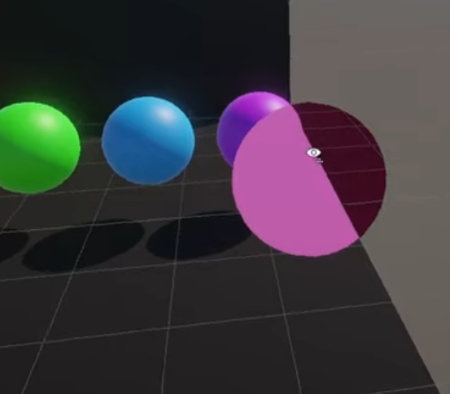

Fckn amazing right? I remember thinking about what I should reply to my teacher if he asked how I would actually work with a surface maybe because he was doubting that I undnerstood the complexity of what I'm bout to research.
And in me explaining stuff to myself I stubled upon this and I felt like such a genius, I explained this too so many different people and I think none of them understood it but I hope at least **you** now do!

SOOOOO HOW DO WE GET THAT OUTLINE NOW YOU MAY ASK???
Well we got big noise and small noise!!!! so in between the big noise and small noise is our line! SOOOOOOOOOOOOOOOOOOOOOOOOOOOOOOOOOOOOOOOOOOOOOOOOOOOO If we subtract the small noise from the big noise we are left with a line!!!!!
0 - 0 becomes 0 remember? So everything black hitting black becomes 0 right? So what about everything white hitting white???? Well 1-1 also becomes zero!!!! So what about everything 0 hitting on 1 AKA THE PART OF THE NOISE THATS BIGGER BECAUSE WE MADE ONE SLIGHTLY SMALLER??????
**KABOOOOOOOOOOOOOOOOOOOMMMM**

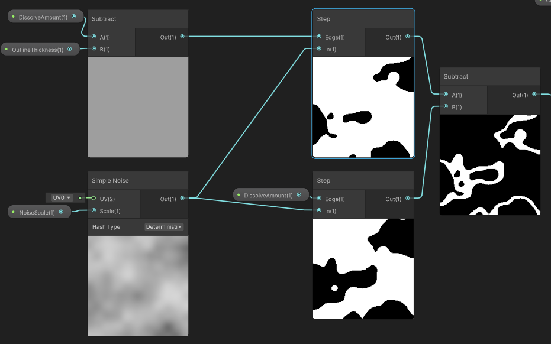
So now we use the smaller version of the noise to set the alpha because we have bigger plans for the bigger one!!!!!!
Actually not, we con't use the bigger one anymore but we will use those hot damn lines we made earlier!!!!!!
But those lines are ofcorse an outline so we'll use it for color, there comes more but for now we can add those white lines to the color and as its while it'll easily overpower the red! (more about this later)
And now this part is done and as you can see the white will sit perfectly on the edges of the holes!!! **Very nice**

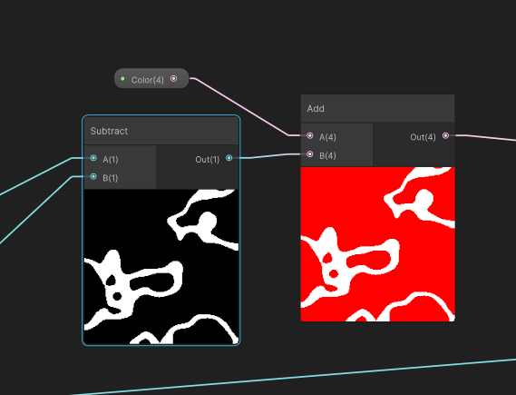
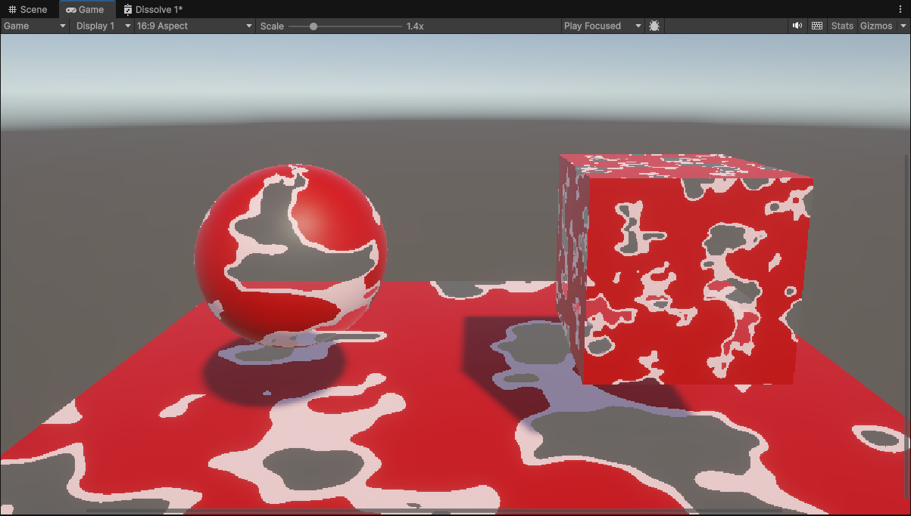


So if you made it this far hot daammmnnn we aren't even done yet this is gonna **SUUUUUUUUUUUUUUUUUUUUUUUUCCCKKKKK** or not depending how hyped you are!
Maybe now is a good time to mention I'm really fucked right now as I'm writing this! Well not on anything bad, just on a pure gym high and cafeine (don't tell my girlfriend about the cafeine, the reason I only mentionn this now is cuz I know she would never read this far). Also I actually have homework for tomorrow, I have to make concept art on a character and I actually can't draw.... But instead of doing this I'm writing a tutorial on shaders and just shitposting to keep myself entertained.... Well can't have it all!

### Border Color
Ooh I liked this one because I actually couldn't follow the tutorial for this part so had to figure it out myself!
So we want to add a custom color to our outer lines, lets just set the color to blue.
Lets start easy, so we have black and white and we want the white lines to be blue! 
So we can simply multiply the color with the lines and we get a beautiful blue lines!

Quick recap on why this is, its obvious but gotta make the click! When you multiply something by 0 it stays 0 **SO IT STAYS BLACK** when you multiply something by 1 it becomes the number you multiply it with **SO IT BECOMES BLUE**.
And that why this works so neatly!

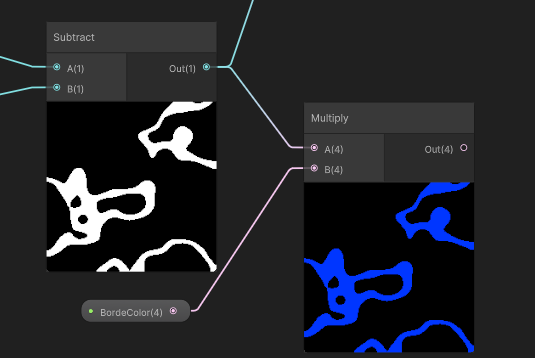

Well but here is where it all went wrong!
As we do no longer have the extreme value of 1 making it perfectly white there something unexpected will happen!
We are now multiplying the RGB value of Blue to the one of red giving us an unintended result!

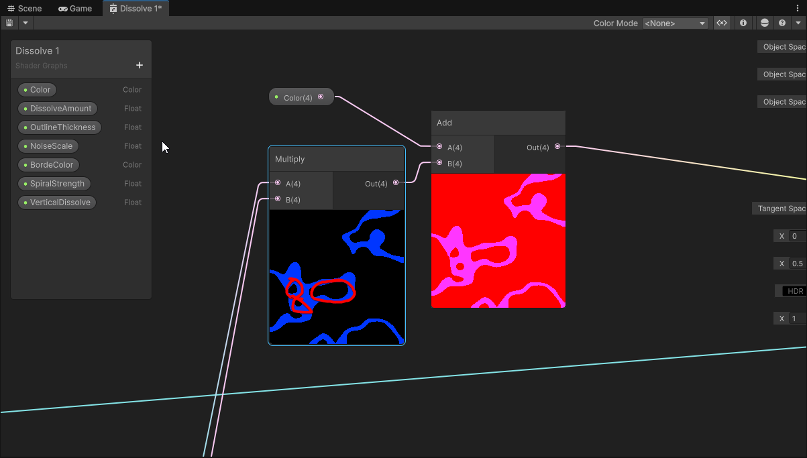

So how do we fix it! AHA Great question, and honestly very obvious, hold my monster energy can!!!
First we cut out the paths from the red, we want to ignore them and them to not include any red so whatever color data is there is just irrelevant after all!
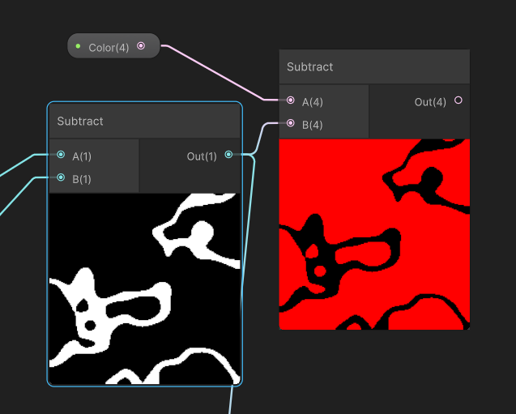

So now we have 2 images with opposite parts, one has a black outer layer another has a black inner layer, which is perfect!!!!!!!!!!!!!
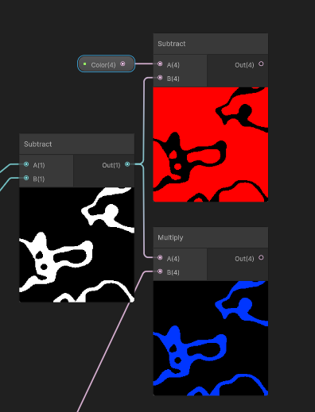

So we can basically use the maximum node!!!! 
Its pretty obvious, it just goes over every pixel and takes the highest value, as these 2 nodes are perfectly in sync we can basically just know it'll be perfect at just taking all the red and blue values as the other option will always be black meaning it'll never be the max!!!

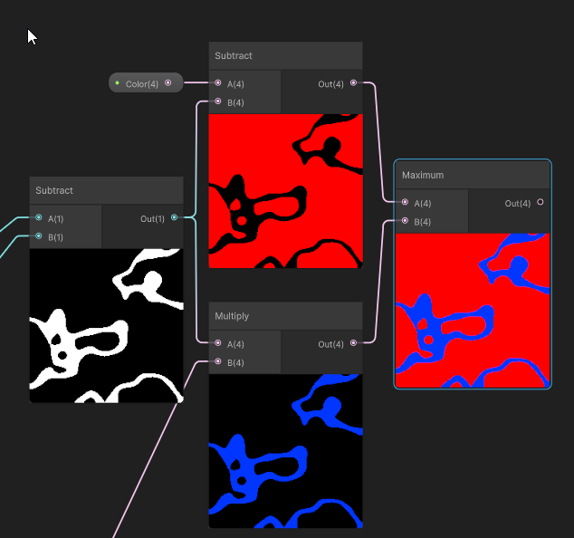

I love math!
Now we basically have a perfectly fine shader with holes and colors!

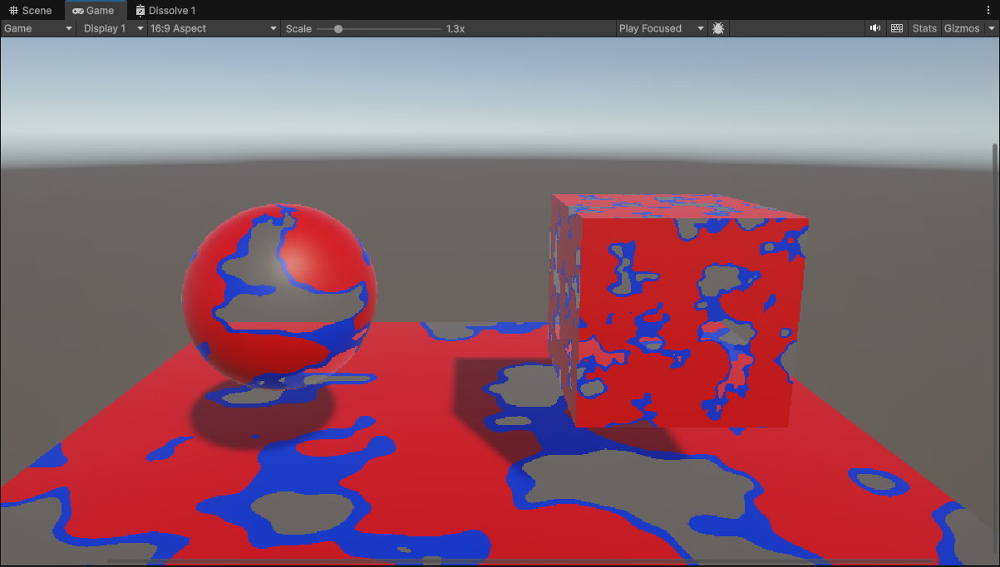


### Spiral strength
Honestly the spiraling strength of my girlfriend is very high!
But spiraling doesn't always have to be related to your girlfriend it can also be in shaders, in simple terms it basically just pulls whatever uv in a lil cute twirl!
So now to actually understand this and this is the first think I don't entirely understand...

the simple idea is ofcorse that it pulls the noise into a swirl, simple enough, could be very cool for terrain generation honestly! 

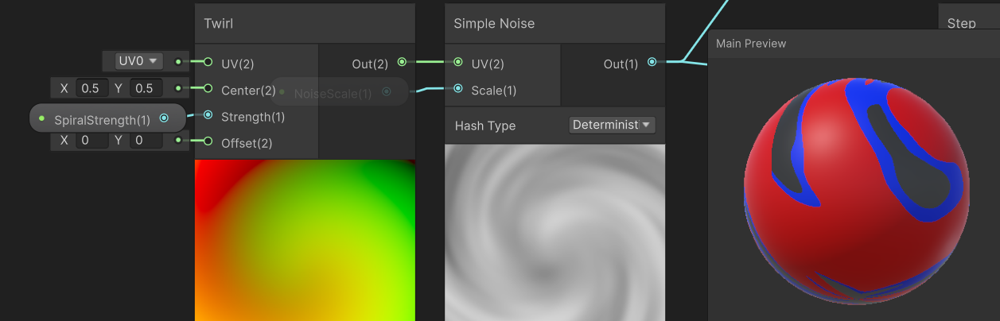

Now no more pictures lets figure this out in the next 20 min because I'm getting tired now, I forgot to take back my monster when u held it and now u emptied it didn't you?
Well honestly the math behind the twirl is beyond me right now and its a bit much to figure out now. What I do want to know is what the connection of twirl does when I plug it into the uv of noise, what does this color mean?

SOOOOOOOOOOOOOOOOOOOOOOO we actually don't twirl the noise!!!!! By applying something else to the uv of the simple noise we adjust the coordinate system it uses. 
Right now noise just works on a grid just a good ol normal grid with squares. Swirl on the other hand has the grid completely messed up, I remember this from grinding GLSL but basically instead of working with normal coordinates twirl changes the coordinates to polar coordinates, shis is the calculation basically `θ = atan2(p.y, p.x)`. From here on out it does some more random weird math signs and then it twirls, twirl is not some math node or something it is a template of a coordinate system. You can make many coordinate systems and apply it, lets try to remake that atan 2 so we only take the start of the twirl calculation and then apply that coordinate system to the noise.
My guess is that we will see just all cicrlces with different opacities....

Well my first attempt didn't work out, it looks cool tho!
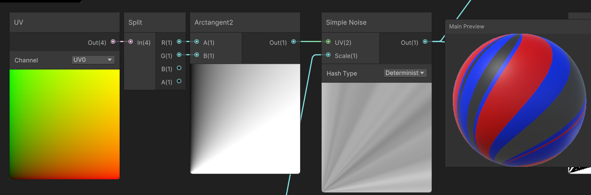

Well it wasn't centered yet but now it is!!!! 
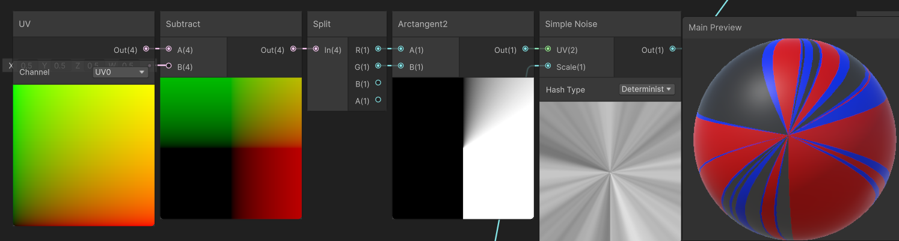

Atan2 is also an interesting thing to understand so I'll do my best to explain while also attempting to understand it myself. ChatGPT says: > Atan2 is a math function that returns the angle of a point (y, x) relative to the origin. So what does this mean? Atan basically checks the direction to the origin. So imagine there is a point on [3,4] we want to know in what direction this is, atan2 returns the direction from your origin (0,0), this means it returns a value in radians (0 to 360). Basically Atan2 asks: "What direction do I look in to see point: [x,y]". Knowing that atan2 always looks from our origin point explains why the first image was in the corner until we centered it! So now how is this Atan2 stuff wrapping the uv like this? Normally when we produce noise its just flat blobs, that's the noise we know and love, when we apply atan to a flat uv we basically make the grid system of x and y go away and instead start working with radians instead, as I explained earlier, atan2 gives the distance between the center and a point, apply atan2 to the whole uv and it will do this for every point in the uv. So as we have a canvas now that instead of working with a flat 2D coordinate grid we start working with only andles towards a center it starts to become more clear the lines are infinitely long as the only value we look at is the angle & nothing else, if the angle doesn't change we know exactly what happens to the line, it just continues eternally. So now the last part, what happens when this atan2 coordinate system that only takes in radians is applied to noise? Noise usually expects a 2D grid so now that we work with 1D (the radiant value) so it starts to generate the same infinite lines originating from the center because that is how the uv now works. As you can see in the picture tho, the lines are still random white values, why is that? I can't go completely into the math behind noise or the interaction between noise and atan2 but its the same concept as how we used noise on the 2D grid, noise creates random blobs that start white and fade at random speeds, same in the atan2 uv coordinates, but you can't make just blobs because that's now how the coordinates work but it uses the same concept but instead of fading over 2d it does it in 1D.


I found this gif on the unity website that nicely shows what noise looks like on different dimensions, the 1D version really shows how it just becomes random lines!

Basically if we take a straight 1D coordinate system it'll constantly go white black white black as you scroll through, now with atan instead of being straight its the same dimension but all points lead to the center creating those same random noise gradients but all pointing towards the center!

Hot damn, I have no clue if that's clear for anyone else reading or not hahahaha but I understand it now! 
Maybe if I want this to one day be actually usefull I'll run my rambings through ChatGPT to clean it up!

Well not the circles I predicted but now we kinda know how that twirl is made we have everything pulled to the center so from here out that swirl is created!!!
Very interesting for sure!!!


### Vertical Dissolve
I feel like this is soo much extra work for something completely unrelated so I will get to this some other time because this will definitly come back and basically is kinda the same concept as the stuff we did with noise earlier.

### Code
Maybe interesting to also add the code used to make it appear, its not much complex stuff so Imma drop it here
```csharp
    private IEnumerator Vanish()
    {
        float elapsedTime = 0f;

        while (elapsedTime < dissolveTime)
        {
            elapsedTime += Time.deltaTime;

            float lerpedDissolve = Mathf.Lerp(0, 1.1f, (elapsedTime / dissolveTime));
            float lerpedVerticalDissolve = Mathf.Lerp(0, 1.1f, (elapsedTime / dissolveTime));

            material.SetFloat(dissolveAmount, lerpedDissolve);
            material.SetFloat(verticalDissolveAmount, lerpedVerticalDissolve);

            yield return null;
        }
    }
```
Maybe the one fancy thing is Mathf.Lerp.
What it normalises the time between 0 and 1.
The time value increases and will always be changed to be between 0 and 1. 
As you see the first 2 parameters are 0 and 1.1.
Basically `(elapsedTime / dissolveTime)` is a very low number that goes up in very low increments when elapsedTime is 0 it lerpedissolve is 0 but as the time increases in value the lerpedDissolve increases just a bit faster, when time is 1 lerpeddisolve is 1.1.
Normalising is a very powerful tool and we will definitly get back to this later!

## That's all for this one folks! 
