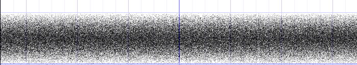

# Unity Shader Experiments

This repository contains **Unity Shader Graph experiments**.

- **Main branch**: a clean template with minimal setup for testing shaders.  
- **Experiment branches**: individual shader projects based on the main branch.  

Branches can include shaders from tutorials or my own creations. The goal of this repository is to **document my experiments and track my learning progress**.

---

## Intersections!!!

This tutorial series is amazing! https://www.youtube.com/watch?v=MndZYDHB4zE&list=PLsaDw3p1XpJiGHPnA8gZH6gO2gQYz3JH1&index=4

The depth buffer is very interesting to keep layers in some kind of order, honestly I'm 3,5 glasses of wine deep and I'm not too happy so lets see where this one will lead me!
Anyway I find comfort in logic and what's more logical than **ROCK HARD SHADER MATH** we'll drink to that!!!!

### The depth buffer!
So in Unity we can skip over rendering something when something is rendered in front of it, basically it doesn't bother rendering something that we don't see anyway, easy enough right?
But now, how does it actually know it? Well we have something named **The frame buffer** which is basically through the Shaders being filled up with all our good 'ol color values.

This isn't what helps us decide on that, for that we have our depth bufffer displaying good ol' normalised whiute values to determine how far something is away from our screen!!!!
So basically, it stores the distance between an object and the camera, so if its closer to the camera its closer to 0, if its further its closer to 1.
Basically if some entities depth value is higher (more white) than a depth value that is in world space in front of it then only render the lowest value pixel!

Bro this guy in the tutorial really just said "Lets explore depth into more depth" I just liked this guy 10x more than I did before writing this!
If there is one thing I really hate about learning stuff its a settings menu! I can learn soo much and then I'm like "Omg this lava shader would look soooo coool" and then I forgot how to set up the bloom setting and have to go look up that one random tutorial that went over bloom just to enable it again!

Well time to look at **depth write** settings!

Well if you read this like 1 our 2 days after writing this I'm focussing on this later, guess I enjoy it most when I got all steps figured out and go deeper into details later! (and maybe when I didn't drink)

Unity stores Depth in something that's calles _CameraDepthTexture which is accessible to the shaders to ofcorse use it to do depth related calculations.
2 Important things to keep in mind:
- Texture only only contains useful information when we are not 

-- The NEXT DAY --
Alright had a little break because I was soo lost, I now made a test scene so I can potentially visualise stuff better now!

Allow material override button is nice as you can edit these depth features from the material object in the inspector

**Using the depth texture is not enabled by default in URP!!!**
1) Find URP asset project is using: In the tutorial it was in assets/settings, jeeejjj!!! Ofcorse that was not the case for me as usual!!!

So if you are like me and nothing ever works on first try folow along!
The file is now renamed and looks like Depth texture is actually enabled by default now, I was able to find it by seeing what was being fed into the quality part of the project settings and there it was!

Alright we are playing with nodes and it is not working for me D:
In the tutorial you are supposed to have color change on the ball where there is no wall behind it but with me nothing changed! 
I had to change surface type to transparent but still no change

We are now 2 hours further and I got exactly NOWHERE!!!!!
The creator also has a website it seems, might as well dive deeper into it: https://danielilett.com/2023-12-20-tut7-6-intro-to-shader-graph-part-4/

But u know I'm done wasting hours on this without knowing for sure what it even is for!
Maybe I'll come back to this detail later but for now I find it more important to understand the rest because unlike this part the rest actually does work and this might as well be some stupid unity thing that changed, I went all over the placeRRRRRRRRRRRRRREEEEEEEEEEEEEEEEEEEEEEEEEEEEEEEEEEEEEEEEEEE

