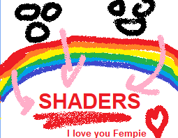

# Unity Shader Experiments

This repository contains **Unity Shader Graph experiments**.

- **Main branch**: a clean template with minimal setup for testing shaders.  
- **Experiment branches**: individual shader projects based on the main branch.  

Branches can include shaders from tutorials or my own creations. The goal of this repository is to **document my experiments and track my learning progress**.

---

## Branch Information
Each experiment branch should include a clear description of what it contains and how it works. 
This is mostly for myself as I memorize and understand subject through explaining them but also me and potential others to refer back to.

Its important to note that I don't aim to just understand the note itself but what goes on under, the math behind the nodes are essential to me as I have goals beyond making nice shaders!
---

## Notes

- Always branch off `main` for new experiments.  
- Keep `main` clean and minimal; different reuseable resources can always be added ofcorse.  
- Name branches clearly and consistently to make them easy to navigate, a creation index is also important.
