# Unity Shader Experiments

This repository contains **Unity Shader Graph experiments**.

- **Main branch**: A clean template with minimal setup for testing shaders  
- **Experiment branches**: Individual shader projects based on the main branch  

Branches may include shaders from tutorials as well as original work. The goal of this repository is to **document my experiments and track my learning progress**.

---

# Dissolve Effect

This shader is based on a tutorial, but adapted for my own use case. The original tutorial focused on 2D, so some equations and setups had to be reworked for 3D.

Tutorial:
https://www.youtube.com/watch?v=HYWaU97-UC4

This write-up is my attempt to break the shader down piece by piece. The goal is not just to explain *what* it does, but to understand the **math and logic behind it**.

Structure for this breakdown:
1. Material properties  
2. Node logic step by step  

---

## Material Properties

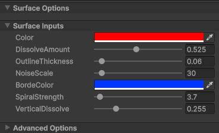

| Property            | Explanation                                                |
|---------------------|------------------------------------------------------------|
| Color               | Base color of the shader                                   |
| Noise Scale         | Size of the noise pattern                                  |
| Dissolve Amount     | Controls how much of the object is dissolved               |
| Outline Thickness   | Thickness of the edge outline                              |
| Border Color        | Color of the outline                                       |
| Spiral Strength     | Strength of UV distortion (twirl effect)                   |
| Vertical Dissolve   | Controls top-to-bottom dissolve                            |

---

### Color

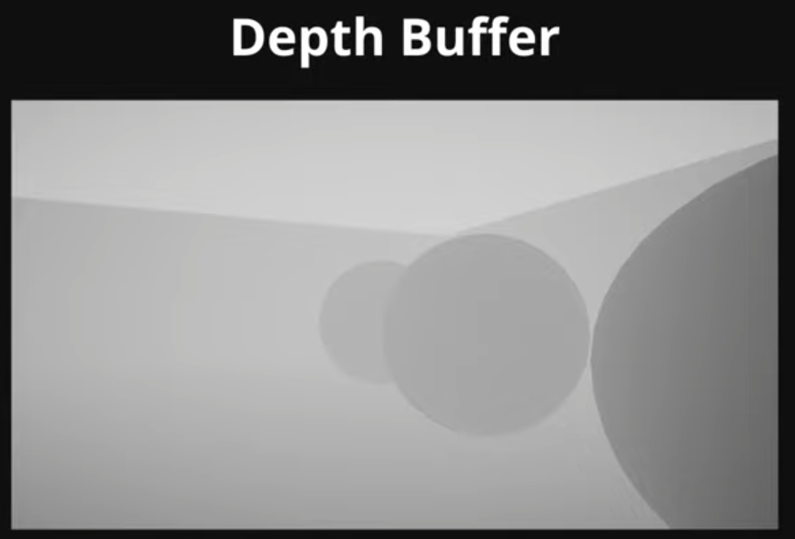

Simple base color input. This becomes more interesting once combined with masks and effects later.

---

### Noise Scale

This is where the effect really starts.

The dissolve is driven by **noise**, specifically Perlin noise, created by Ken Perlin. It produces smooth pseudo-random values between 0 and 1.

Applying noise to the **alpha** gives us transparency variation:
- 0 = fully transparent  
- 1 = fully visible  

Result: a solid object with soft, cloudy holes.

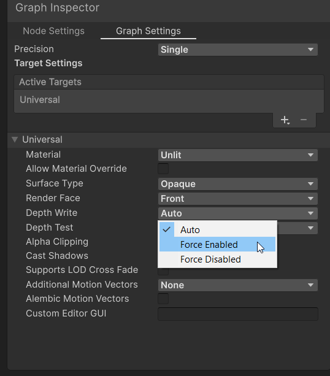
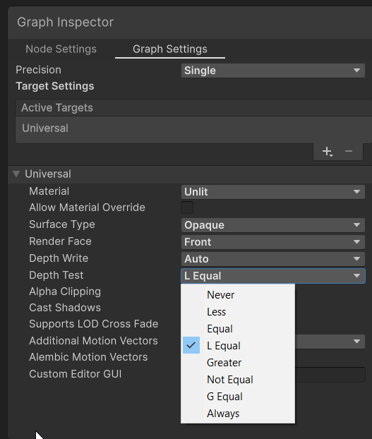

#### Why noise works

Noise is not purely random. It’s **continuous**, meaning values blend smoothly. That’s why we get gradients instead of static noise.

---

### Step Function

To turn soft gradients into sharp holes, we use a **step function**.

- Values above threshold → 1  
- Values below threshold → 0  

Low threshold:
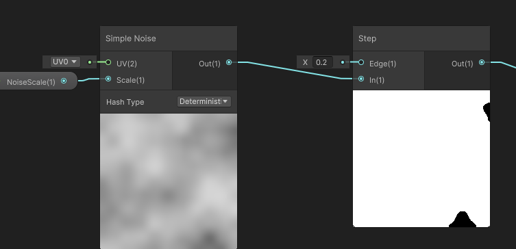

High threshold:
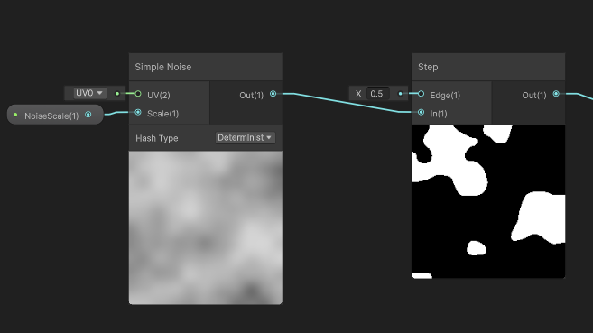

Result:
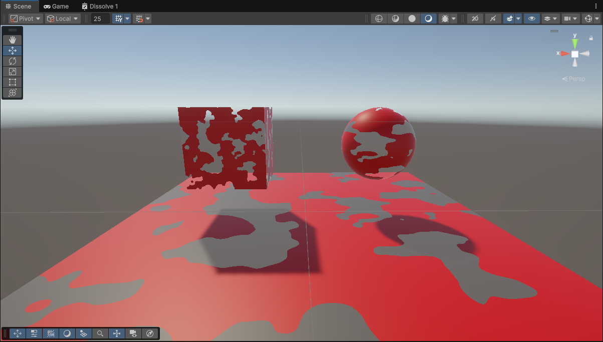

Clean, sharp dissolve holes.

---

### Dissolve Amount

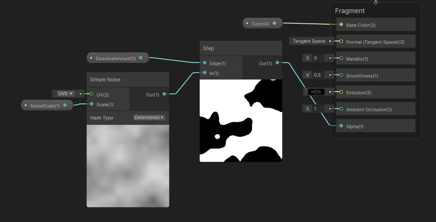

Instead of hardcoding the threshold, we expose it as a parameter.

Important distinction:
- This does **not change the noise itself**
- It controls **how much of the noise is visible**

---

### Outline Thickness

This is where things get interesting.

We create an outline by using **two thresholds**:

- Main dissolve threshold  
- Slightly lower threshold  

Formula:
dissolveAmount - outlineThickness


Example:
- dissolve = 0.5  
- thickness = 0.05  
- result = 0.45  

This creates:
- A larger mask  
- A slightly smaller mask  

Subtracting them gives us the **edge between them**.

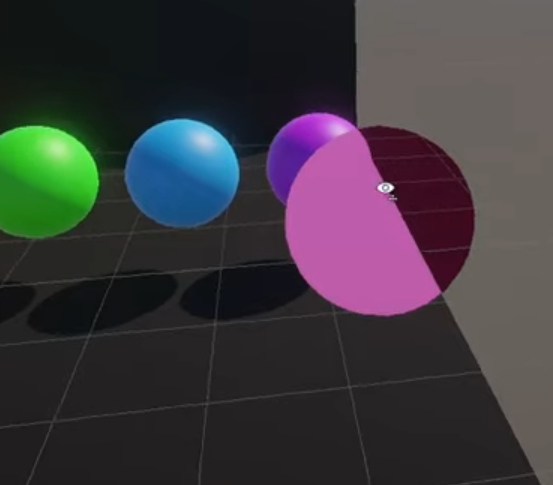

Result:
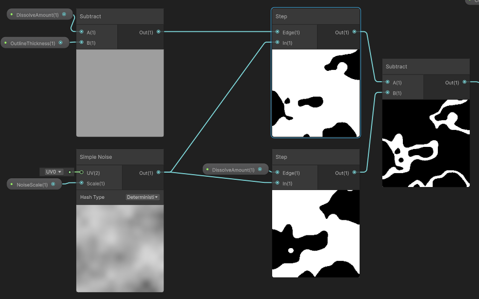

That difference = the outline.

---

### Border Color

We want to color only the outline.

Naive approach:
- Multiply outline (0 or 1) with color

Works because:
- 0 × anything = 0 (black)  
- 1 × color = color  

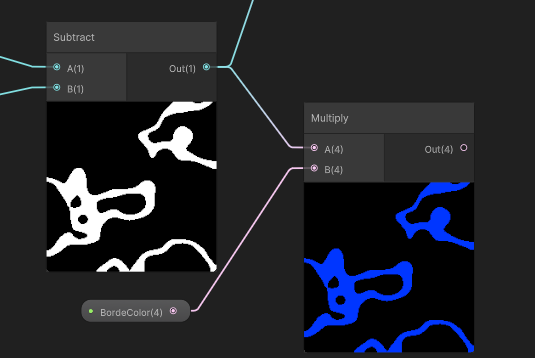

#### Problem

Multiplying directly with the base color causes color blending issues.

#### Solution

Split into two masks:
- Inner (object)
- Outer (outline)

Then combine using **Max node**:
- Keeps the strongest value per pixel

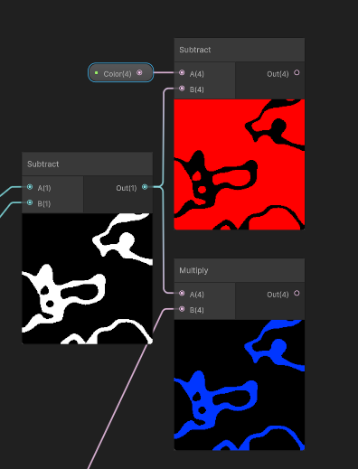
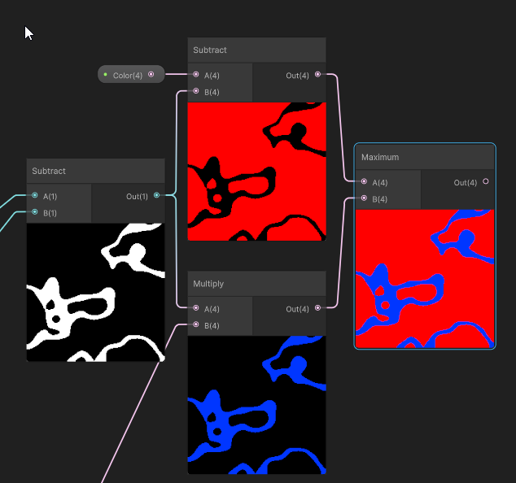

Result:
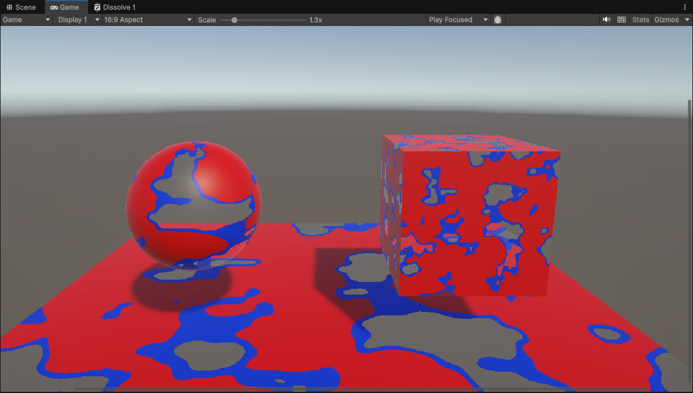

---

### Spiral Strength

This affects the **UV coordinates**, not the noise itself.

Instead of modifying the texture, we modify **how the texture is sampled**.

The twirl effect works by converting UVs into a different coordinate system using:
θ = atan2(y, x)


This changes the grid into **polar coordinates**, centered around a point.

Effect:
- Straight noise → warped into circular/spiral patterns  

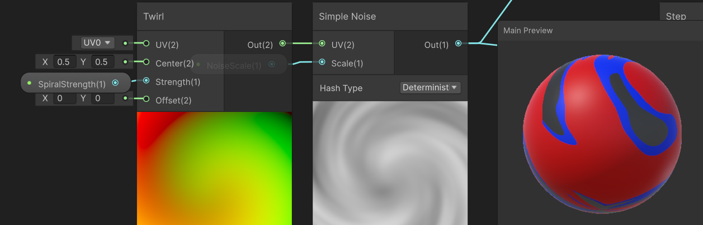

Key idea:
> We are not twisting the noise, we are twisting the **space the noise is sampled in**.

---

### Vertical Dissolve

Not covered in detail yet. Conceptually similar:
- Uses position (Y axis) as an additional mask  
- Controls dissolve direction (top to bottom)

---

## Code

```csharp
private IEnumerator Vanish()
{
    float elapsedTime = 0f;

    while (elapsedTime < dissolveTime)
    {
        elapsedTime += Time.deltaTime;

        float lerpedDissolve = Mathf.Lerp(0, 1.1f, elapsedTime / dissolveTime);
        float lerpedVerticalDissolve = Mathf.Lerp(0, 1.1f, elapsedTime / dissolveTime);

        material.SetFloat(dissolveAmount, lerpedDissolve);
        material.SetFloat(verticalDissolveAmount, lerpedVerticalDissolve);

        yield return null;
    }
}
```

Mathf.Lerp(a, b, t) interpolates between two values:

t = 0 → returns a
t = 1 → returns b

Here:

Time is normalized: (elapsedTime / dissolveTime)
Result smoothly transitions from 0 → 1.1

This drives the dissolve over time.
