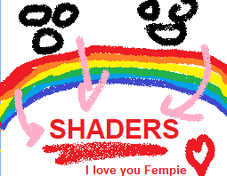

# Unity Shader Experiments

This repository contains **Unity Shader Graph experiments**.

- **Main branch**: a clean template with minimal setup for testing shaders.  
- **Experiment branches**: individual shader projects based on the main branch.  

Branches can include shaders from tutorials or my own creations. The goal of this repository is to **document my experiments and track my learning progress**.

---

## Foreword

Source: https://www.youtube.com/watch?v=pFQ2-HFG_hY

This is gonna be a big one but honestly its such a golden source of info involving many interesting steps, new nodes and even HLSL!!!!
I'm both devastated and super excited to disect this lava shader!!!!

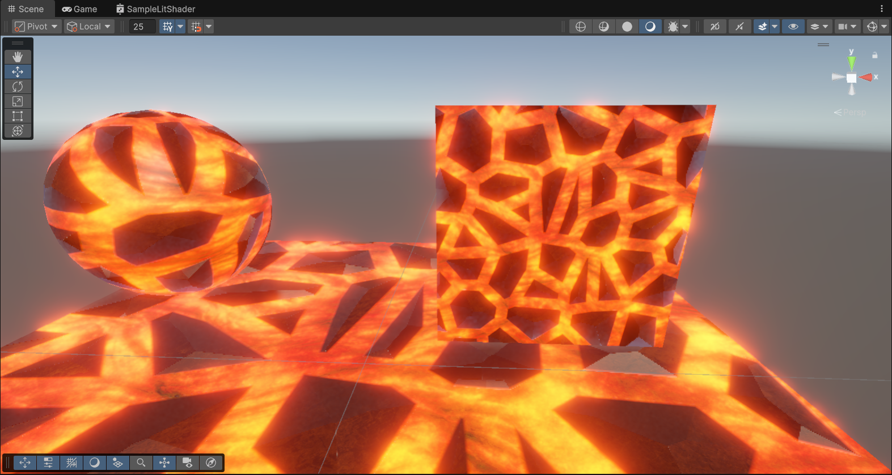

Well here are the nodes we'll be working with!

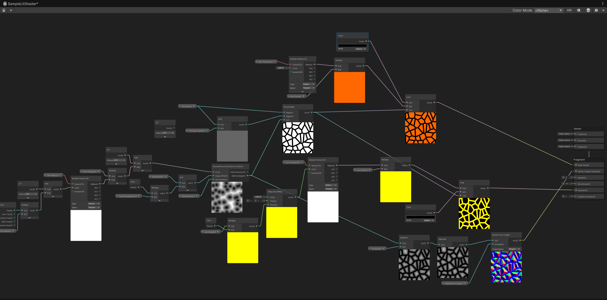
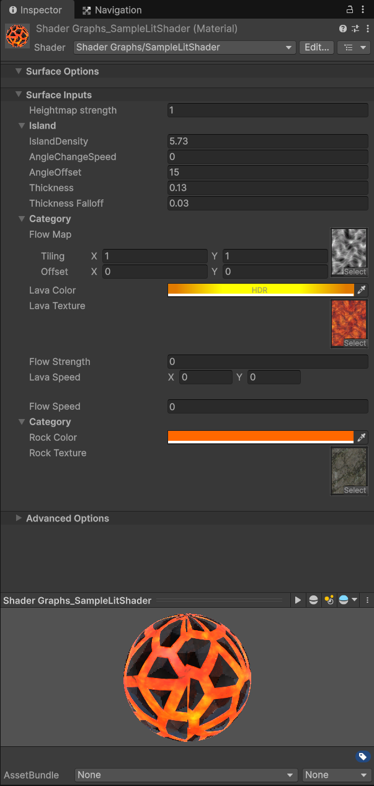

This might be the most intimidating/overwelming thing I've ever seen...
Ooh wait my girlfriend exists....
Anyway lets disect its intricacies by rebuilding the shader from the ground up and see what we can learn!

## Disecting the shader!

### Voronoi
So first we start with the core of this lava shader (The reason I choose to look for a lava shaders was because I just knew it would have these kind of golden insights! 
The voronoi pattern!!! I truly intend to disect this one as I inten to use Voronoi as the bottom layer of my procedural world generation algorithm, lets dive right into it!
For starters we used a HLSL script for the voronoi, so why don't we use the unity given voronoi... Well lets just check it out what it gives us!

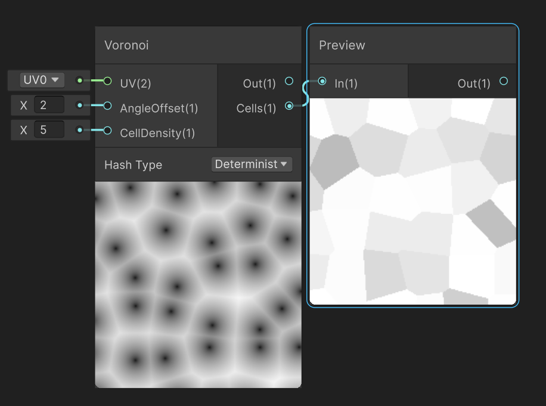

So we got our voronoi texture with some nice settings and we can also take out a flat surfaces
LETS GO AND TWIRL EM UP BABYYYY (I'm soo happy I took the time to understand UV's last week!!!

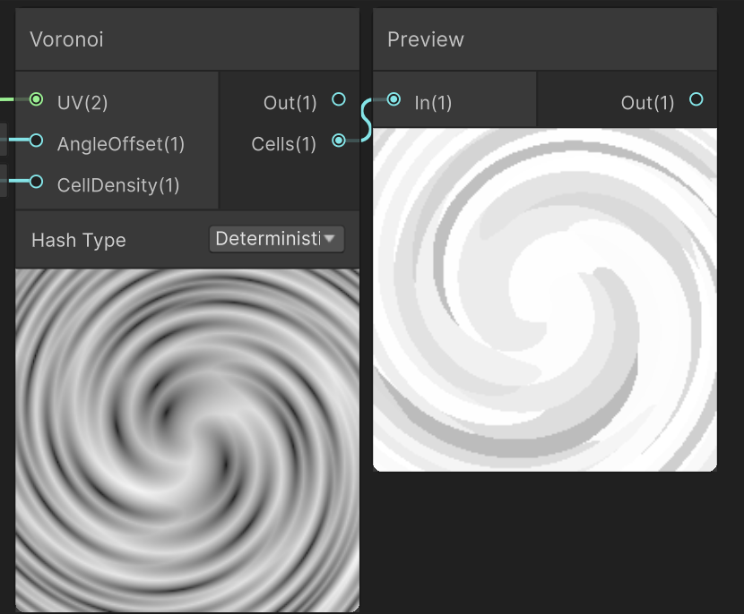

Anyway as you can see in our earlier example we have lava lines on our shader and those are not being outputted.


So I'm all up for writing some voronoi code but in this case why? Can't we just smoothstep our way out of this problem?
Answer: Nope because for some reason vornoi's are balls not whatever shape is displayed???? Crazy!!!!

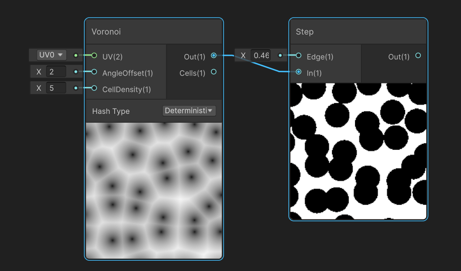

So lets take a step back and learn how Vornoi works for this I'm taking Inigo Quilez on my left monitor!: https://iquilezles.org/articles/voronoise .
Two of the most common building blocks for procedural generation are noise and ofcorse there are many generations with Perlin noise (those blobs) to be the most relevant! And after that comes Voronoi noise which is the star of today's show!
Voronoi ofcorse has its own set of variantions but the concept is that it creates a grid and then places a point on a random position in each cell. In this article it says perlin noise also works with a grid but one has organisators and voronoi has those generators jittered somewhere on the grid? I don't really get it so lets maybe take another step back and figure out the difference between perlin noise and vornoi noise!

So first of all: Both perlin noise and Vornoi Noise work in a grid! But what is stored on a grid is different, so as you see below here is the core difference! 
Perlin noise is depicted with arrows, what do these arrows mean? Perlin noise takes each corner (named lattice point) and gives it a direction and magnitude, this decides in what direction the noise goes and how far its pulled (I'm just assuming the magnitude is some kind of normalised value) it then gets blended with all other noise values to get the blobs we know & love. Vornoi works with finding the closest feature point to each location (feature points are the random dots drawn on each sell in the grid), these feature points are the centers of the cell. A big plot twist tho, Vornoi doesn't actually use the grid like for example noise does, noise lives on its grid while Vornoi generates a grid to more easily check what points are generated nearby rather than with perlin noise where the grid is the foundation of the algorithm. So in short: Vornoi sets random dots on a place and uses a grid to help itself with finding other points in their neigborhood, basically if you take it away its concept can still work at a significant performance cost. While perlin noise relies on the intersections of the grid to find where to point its arrows to and create the blobs!

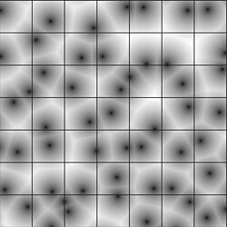
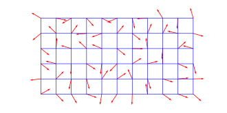

Haha it's not done yet, but almost! So we have our points and the unique data it contains so what happens with that data? So with perlin we use something named Lattice points and those arrows. SOOOOOOOOOOOOOOOOOO after a bit of looking I found such a wonderfull picture that really shows how these arros work! So As you can see the white value increases in what direction the arrow points for example at coordinate [x3,y1][x3,y2][x3,y3] you can see a beautifull long black blob as the arrow points point in the opposite direction meaning no gradient is being formed in that direction. Ofcorse to smooth things out there will be soft gradients going in the opposite direction I guess if an arrow points to [y0.5,x0.5] it'll  draw a gradient with the whitest point being 0.5 0.5 and the darkest being -0.5 -0.5 (the opposite) something like that I bet!

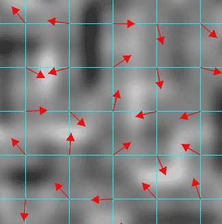

Vornoi is a little different! Lets see how it works! First of all Vornoi does not take an angle to create gradients like Perlin noise does! First of all Vornoi has no gradient stored or generated anywhere unline Perlin noise! Instead Vornoi noise is purely built up out of feature points (those random points) and distances between your sample point and feature point. So just to clearify a sample point is literally just any value where you want to know the value of the noise. For example noise(x, y) returns 1 random value of the noise on that position, the x,y is the sample point. The feature point on the other hand are those random dots that appear. So what do they do how do they relate? SOOOOOOOOOOOOOOOOOO I'm gonna cook this one up in photoshop so I can visualise it! Nvm I'll use Illustrator.

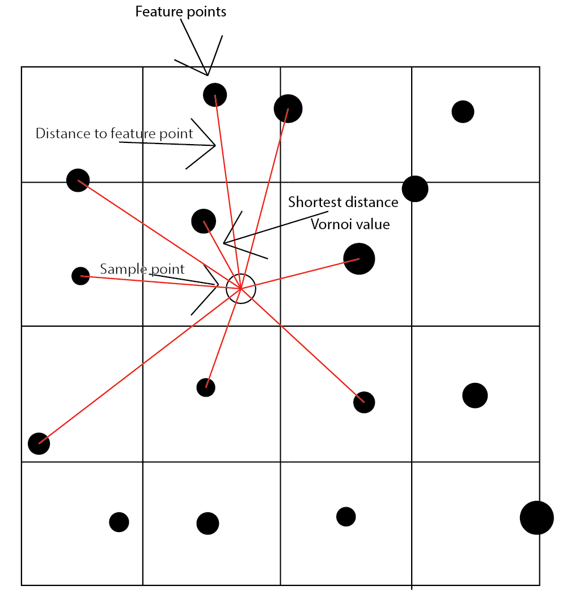

Anyway SO HERE YOU HAVE VORNOI NOISE!!!! This is what you get:
- Feature points: Each grid got a random feature point, this is just 1 pixel/point on in each grid!
- Sample points: Every pixel that is being evaluated so basically just a position that's being inputted in the vornoi (as you can see vornoi noise is not that gradient like stuff you would expect yet)
- Dinstances: every distance between your sample point and all feature points
- Vornoi value: this is the distance from the sample point to the closest feature point, usually that's the one that the grid is in but it's definitly not uncommon for a sample point to have a feature point in another grid!

So **this is vornoi noise** no gradients or polygons or anything this is what we get, but with this data we can make all those fancy sell things we want to make! So what really happens, we have all this data, how do we make a little sharp blob? First we get the closest feature point, it'll check all 9 grid cells around the sample points and collecdt the distances, then we get the minimum distance! 

Alright I basically completely got lost for a bit. In my previous example I had 1 sample point to calculate, but this actually happens for every coordinate in a grid, meaning if each grid has 100 coordinates there will be 99 sample points and 1 feature points! each coordinate will see its distance to its closest feature point and will be assigned a number, furthest away will receive a 1 while closest by will be 0, that's ofcorse why everything starts as a black perfect circle and as you go further away it'll change in our cell like structures because then other feature points will start being closer meaning the sample points will start looking at them for distance! and that's how we get those vornoi tiles! So we will manually assign a max radius so basically if we set the max of .5 if we keep increasing away from the feature point we can clamp everything to 1 over .5 so we will have our gradient and everything beyond the value of .5 will clamp to 1 giving us a fixed radius. Another way to have it be black at the start and white at the edge is by doing `currentFeaturePoint/closestFeaturePoint` this value we can then use to find the outer most value we can then do `sampleValue = normalise(distanceFromClosestFeaturePoint, currentFeaturePoint/closestFeaturePoint)` this way instead of just basing the sample points value on the distance between it and the feature point closest it'll always normalise its value between 0 and 1 meaning the furthest possible distance away will always be 1 (even if its maybe 0.75 or smth) and closest will always be 0!!! I don't know how clear it is but it is to me now!

Now Imma hit the gym... I ate soo much sugar to get through this one omfg, I'm soo happy I understand it now but this stuff was way more complex than I thought, but now I have all the tools to disect the next code!!!!

Its very cool to see, when I set out on this journey I started with Inigo Quilez's articles but I ofcorse didn't really understand anything really or more like: I couldn't place his insight anywhere to make procedurally generated worlds... But now I'm quite a bit further in my journey and I see exacly why its sooo relevant, its such an amazing step forward to finally come back here and built more relevant understandings!

Alright now I'm very excited to finally get to disecting the code!!!
But honestly I prefer to not just take the code and go over each line, instead I will try to  write my own Vornoi HLSL code! Here we go!!!


```hlsl
inline float2 randomVector (float2 UV, float offset)
{
    float2x2 m = float2x2(15.27, 47.63, 99.41, 89.98);
    UV = frac(sin(mul(UV, m)) * 46839.32);
    return float2(sin(UV.y*+offset)*0.5+0.5, cos(UV.x*offset)*0.5+0.5);
}

// Based on code by Inigo Quilez: https://iquilezles.org/articles/voronoilines/
void CustomVoronoi_float(float2 UV, float AngleOffset, float CellDensity, out float DistFromCenter, out float DistFromEdge)
{
    int2 cell = floor(UV * CellDensity);
    float2 posInCell = frac(UV * CellDensity);

    DistFromCenter = 8.0f;
    float2 closestOffset;

    for(int y = -1; y <= 1; ++y)
    {
        for(int x = -1; x <= 1; ++x)
        {
            int2 cellToCheck = int2(x, y);
            float2 cellOffset = float2(cellToCheck) - posInCell + randomVector(cell + cellToCheck, AngleOffset);

            float distToPoint = dot(cellOffset, cellOffset);

            if(distToPoint < DistFromCenter)
            {
                DistFromCenter = distToPoint;
                closestOffset = cellOffset;
            }
        }
    }

    DistFromEdge = 8.0f;

    for(int y = -1; y <= 1; ++y)
    {
        for(int x = -1; x <= 1; ++x)
        {
            int2 cellToCheck = int2(x, y);
            float2 cellOffset = float2(cellToCheck) - posInCell + randomVector(cell + cellToCheck, AngleOffset);

            float distToEdge = dot(0.5f * (closestOffset + cellOffset), normalize(cellOffset - closestOffset));

            DistFromEdge = min(DistFromEdge, distToEdge);
        }
    }
}
```

So here we go this is where we are for now!
Seems like you always need to add _float on the back and for example doing out float2 and setting name to _float2 does not work but hey at least we seeing light in the graph editor!
```hlsl
void DoVornoi_float(float2 UV, out float test)
{
    test = 1.0;
}

```

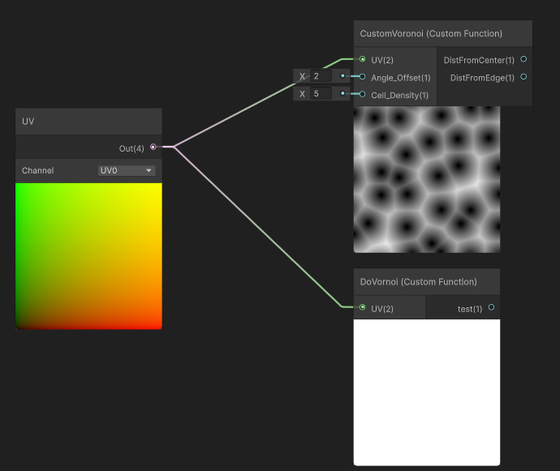

So what do we have right now, we sent in an uv (our grid btw, this is where we will draw dots in) and test for out. I don't know how I can out anything else but I believe float will be fine and I'll figure out other outputs when its relevant! So now guess I'll try to disect from the above code what places random dots on the grid. So I'm currently reading up on Inigo Quilez on SmoothVornoi, I feel like it'll be a good place to start. The above code is also looking to introduce egdes etc but honestly I don't want to bother with that, when trying to learn it is important to not go to fast, you can achieve more by aiming to: ONLY HAVE DOTS (Feature points) over anything!


First we want a random number generator! So throughout my shader journey I've seen some cool ways of generating pseudo random values so the basic concept is that you squash a sine wave on top of eachother so hard it returns seemingly random values as there will be points spawned all over the place! This is a great source: https://thebookofshaders.com/10/

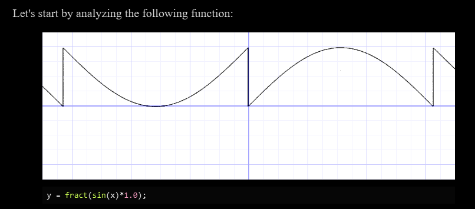
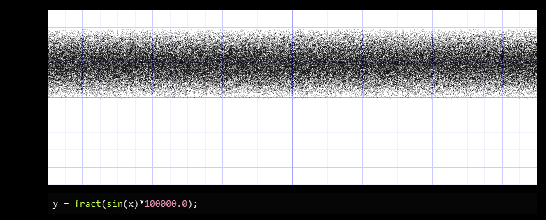

Now this example is only in one dimension so guess what? Yeah ofcorse we are not getting at all what we wanted! (I have some other code down already to visualise this well, I already set up a very basic grid that shows the dots in a vornoi way. Ikr, couldn't believe my eyes that I'm actually going forward with this lmfao.

```hlsl
	float2 hash2(float2 p)
	{
		return frac(sin(p) * 10000.0);
	}
```

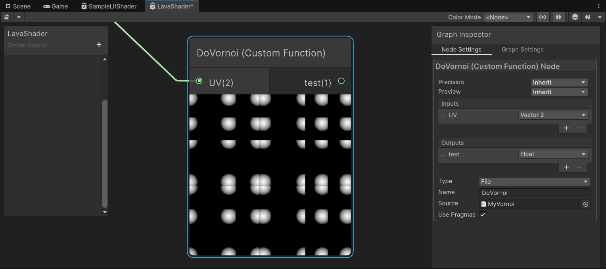

So now we need to make this fancy thing work with 2D values. For this the dot() function will be doing some heavy damn lifting. So first of all, what does Dot() do? Well very simple actually it multiplies each component and then adds them. So basically if we have: `dot( float2(x, y), float2(A, B) )` it'll do `x * A + y * B` simple enough right? Basic math. But ofcorse we are working with a grid so ofcorse x,y will be different, if our uv grid is 12 it'll for each grid position get the dot product ofcorse. So when we feed the values of these completely messed up lines in a sine we will get some kind of tv noise. Because once again its not just being messed up up and down but also left and right as we gave both sides a big messy bunch of values!

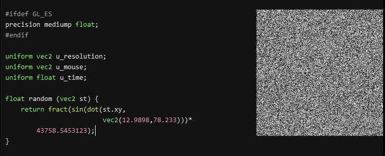

So now to put in into hlsl, is almost the same as the GLSL above! We first do the float2 multiplication (in GLSL you can just multiplay a vec2 with vec2 in HLSL they need to be split up). So we use some seemingly random numbers to multiply our grid pos with! I had MrGPT choose them for me but basically to prevent any weirdness MrGPT made sure they:
- Are not multiplies of eachother
- Are not small
- Avoid obvious patterns (Making sure they don't line up in any obvious way)
- Make sure the dot products are far apart

```hlsl
	float2 hash2(float2 p)
	{
		p = float2(dot(p, float2(127.1, 311.7)),
				   dot(p, float2(269.5, 183.3)));
		return frac(sin(p)*100000.0);
	}
```

We then bash this back in our previous sin but this time our values are actually already mixed up before they get jittered the shit out of them creating our beautifull random dot positions!

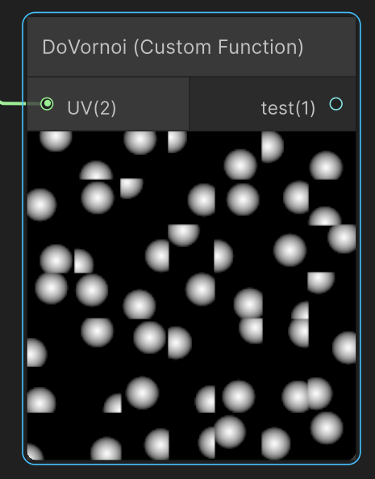

Now time for bed, I have a physical board game to pitch tomorrow! (Honestly I never thought I'd enjoy making physical games but honestly my teachers passion is really captivating and I started really to appreciate it like an artform, I always grind sooo hard to built my technical foundation but making a physical game is just all about the idea without all the headacackes of trying to rewrite a Vornoi and stuff, its been a great journey so far becoming a game designer!)

PS. frac makes all values positive so a sine goes in a circle between -1 and 1 but frac makes everything under 0 -> positive so that's why we only get positive values in out hash2

Ooh god its been over a month since I worked on this page.... I was very busy with deadlines and other things, getting back to this one will be so rough. Gonna reread the previous stuff but omfg I really hope I kept it clear!
Honestly... Damn I remembered most still before we got to the code and the actual code after a lil refresher came out pretty neatly!

But now this generates random numbers but ofcorse there's no way that this just gets us balls in squares right? So why does that happen, well to visualise I added some more code already so now I should probably dive into these first before moving forward!

first of all we need to make this into a grid! The book of shaders ofcorse got us covered: https://thebookofshaders.com/09/ !

So first we take our uv, this is basically like the canvas we draw upon.
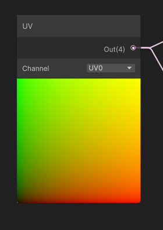

If we where to just use that we would just have one big square and ofcorse only space for 1 blob to appear!
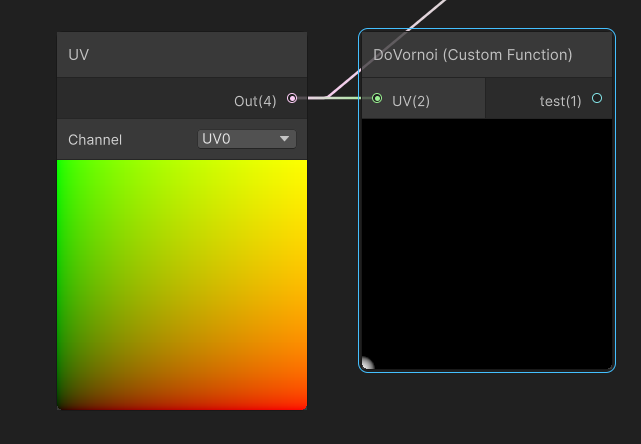
if we multiply it by 2 and floor it back aka wrap it around we get 4!
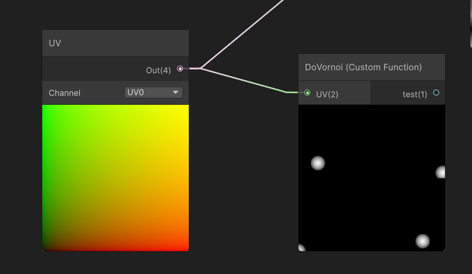

So In code that would look like this:
```hlsl
    float scale = 2.0;
    float2 gridUV = UV * scale;
    float2 cell = floor(gridUV);
```
Interesting to note is that ofc a gridUV is a vector 2 so it has x and y values but in HLSL you can multiply float2 by float multiplying both x and y by the float.
So I want to recreate this with nodes so we can visualise what is happening!
First.... Can I also do the same multiplication trick in the shader graph???

Well so far nope! its just black!
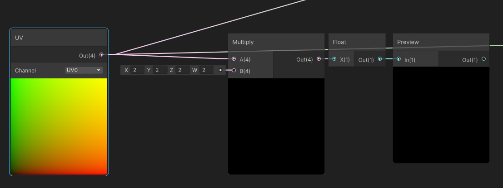
HUH WHY TF DOES IT WORK NOW? HAHAHAHHAHAHA
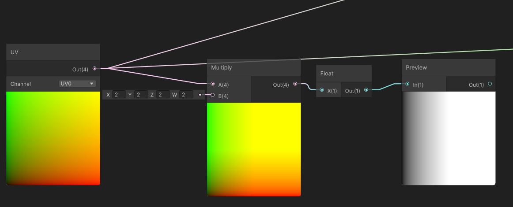
But still what I am supposed to get is squares with these colors not a line.... Hmmmmm
Ooh its because because I'm a morron!!! I accidentally put it into float making the uv one dimensional HAHAHAHAHHAA.

But ooh my god now it gets super weird!
So the working code uses floor to give me the intended result of the balls but for some reason fraction (As shown in the book of shaders) shows the result I'm actually looking for???????
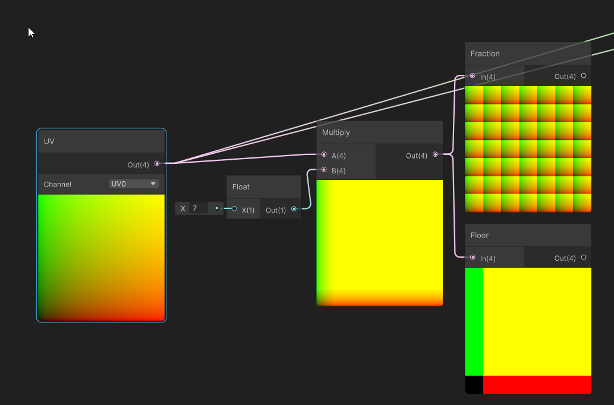
Broo hahahaha Alright time to deepdive floor and faction man HAHAHAHAHHAHAHAHAH

Alright first of all what do they do, I think I've gone over this a while back but I forgot so here we go!
Floor is pretty straightforward, everything past the comma gets yeeted out 0 = 0, 0.8 = 0, 1 = 1 and 1.6 = 1 . Straightforward enough so why do I get that stuff with the big square?
Well its not that deep honestly! An uv is values between (0,0) and (1,1) meaning that everything under 1 even if its .9999999 will be 0 giving a big black box!
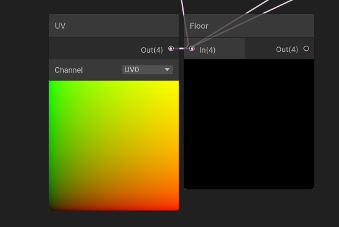
So now what if we multiply it by 2? 
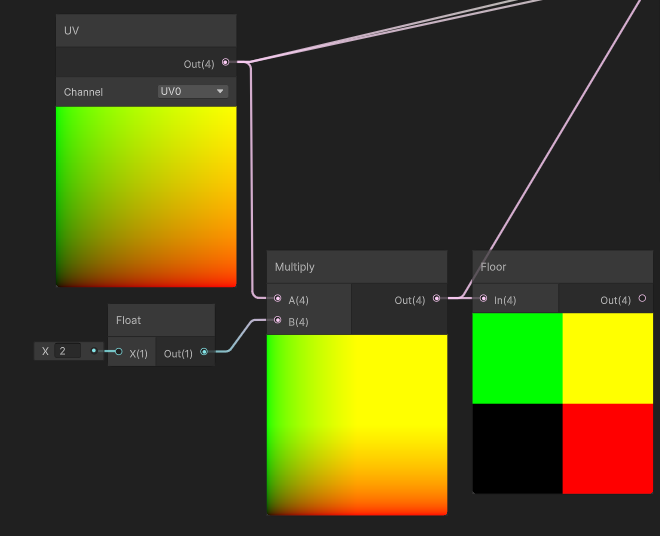
Well now we got evenly spread squares but honestly it also makes sense! Now we have a value between 0 and 2 everything over 1 becomes 1 everything under becomes 0. So why the different colors? Well uv is just a vector2 that has its area normalised to a value between 0 and 1. These vector2 values are depicted with RGB colors with X representing Red and Y representing green so ofcorse going up means it'll be green or nothing and sideways red or nothing and once you go over 1 in both x and y it gets combined into yellow! So that makes sense... Nice!

So what about Fraction because that is the sensible thing here! Actually not I already did dive deep into fract and it still kinda does not make sense to me! Well here we go!
So fract basically loops access numbers back I believe 
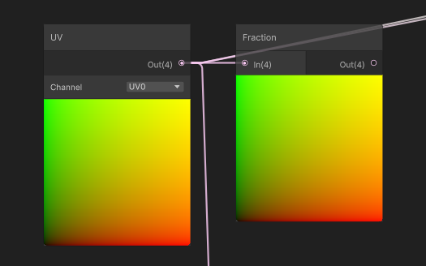

Alright so quick before bed! I was laying with my girlfriend in bed processing todays work and I was thinking about fract and it finally daunted on me it now makes sense to me!!!
No image that's for tomorrow just typing! So imagine we are doing a multiply times2! Floor takes everything past the . away but fract will take everything before the . away!
So what does this mean for our uv. If we have our coordinates from 0 to 2 it will take every coordinate from 0 to 2 and assign it a value. So if we do nothing it basically looks like nothing has happened at all the uv looks the same! When we floor it it basically cuts it in 4 diff squares why we explained earlier but with fract we will get 4 suares that look exactly like the initial uv? why
WELLLLLL we are not looking at the initial number in front of the dot so once we go past 1 we start at 0 again zo at coordinate y0 x0.5 and y0 x1.5 we will both have the value x 0.5 because the number before the . will always be 0!!!! OMG I LOVE YOU FEMKE, her cuddles always make me get comfortable giving my brain space to breath and process any lingering thoughts in the background!
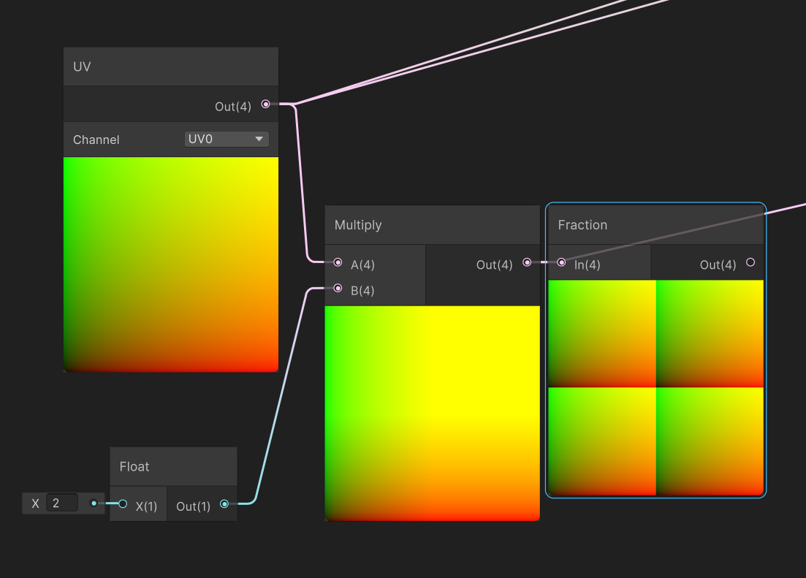

Alright we are back! so we now made sense of what floor and fract do, so now its time to figure out why tf the code uses floor!
So normally if I remove this code:

```hlsl
    float scale = 2.0;
    float2 gridUV = UV * scale;
    float2 cell = floor(gridUV);
```

and instead put in the uv that I fractioned myself and then place a random number each I should get the same result right? 
Well lets see!
Our code right now: 

```
float2 hash2(float2 p)
{
    p = float2(dot(p, float2(127.1, 311.7)),
               dot(p, float2(269.5, 183.3)));
    return frac(sin(p)*100000.0);
}

void DoVornoi_float(float2 UV, out float test)
{
    float2 featurePoint = hash2(UV);
    float2 featureUV = (cell + featurePoint) / scale;

    float dist = distance(UV, featureUV);

    test = saturate(1.0 - dist * 20.0);
}
```

(the code on the bottom that wasn't mentioned yet is to visualise the dots)

Aaannndd we basically get static noise: 
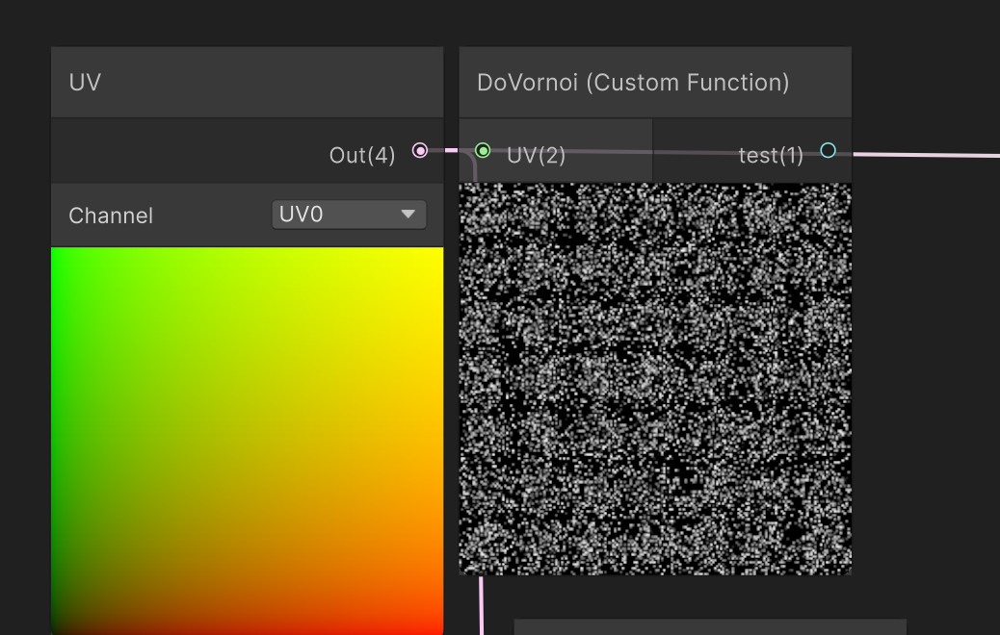


So I was curious what would each uv output if I try to set my featurepoints:
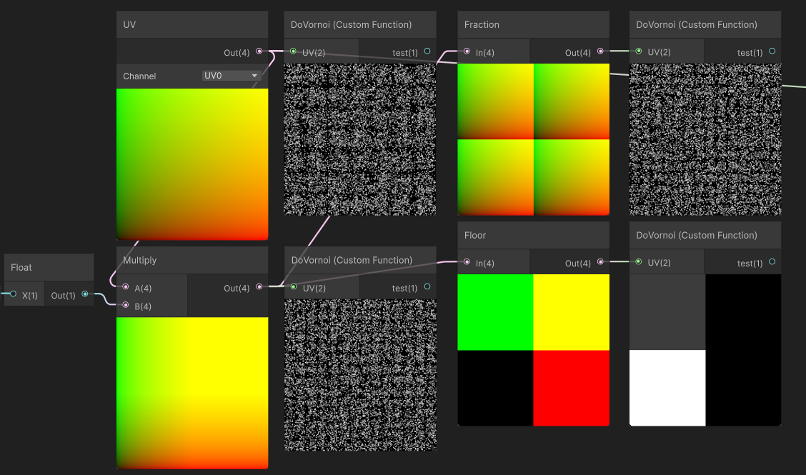
Looks like there is nothing sensible so far! But why because aren't we literally doing this?
```hlsl
    float scale = 7.0;
    float2 gridUV = UV * scale;
    float2 cell = floor(gridUV);
```

Ooh first of all because I'm a morron and I had gridUV still in instead of UV, its still not as intended but this helps haha
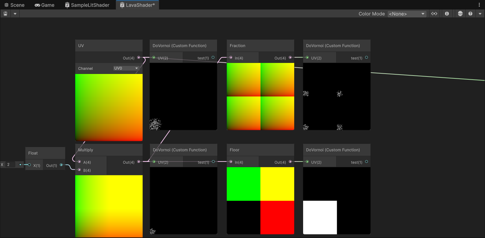

I needed a break yesterday but hey back to work, this is a lot to grasp today!
This I have not done yet but I feel like I have to, for now Imma say "fuck it" on why the uv doesn't work from the graph editor, I only have so much time and way to much work to go! so it's time to get back to focussing on code!

But one thing to call out, once we go back to normal code I do get a somewhat sensible result worth noting!
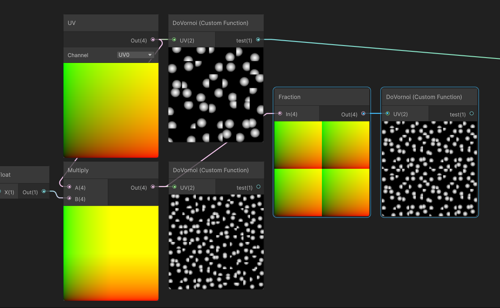

Anyway lets disect the code because that was my goal in the first place, just a reminder what we have:

```
float2 hash2(float2 p)
{
    p = float2(dot(p, float2(127.1, 311.7)),
               dot(p, float2(269.5, 183.3)));
    return frac(sin(p)*100000.0);
}

void DoVornoi_float(float2 UV, out float test)
{
    float scale = 7.0;

    float2 gridUV = UV * scale;

    float2 cell = floor(gridUV);

    float2 featurePoint = hash2(cell);
    float2 featureUV = (cell + featurePoint) / scale;

    float dist = distance(UV, featureUV);

    test = saturate(1.0 - dist * 20.0);
}
```

So we have the scale and how we add it that makes enough sense, what to me is curious is why its using floor instead of fract...
Just for reference when I replace floor with frac:
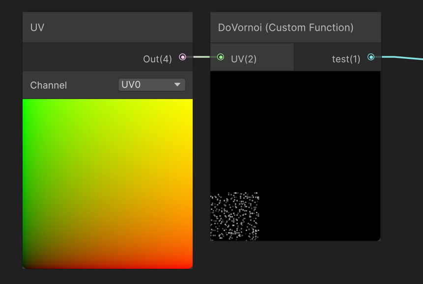
Looks like there's just a lot of dots appearing on 1/14th of the grid.

Well lets break down why we use floor, first of all what does Voronoi need conceptually for us to make our own?
- A divided space in a grid of cells (Well it can be without but it helps a ton with processing and logic to do it with a grid)
- feature points, we'll also put them in the grid
- and for each pixel that isn't a feature point it needs a distance to its closest 

ooooooooooooooooooooooh alright I see ya now
so what des floor do chat? it ofc cuts all the stuff away after the . and frac cuts all in front. When we worked with the uv we use frac cuz every location has a value and what the value is will be determined with frac
So why is this not the case in our code, well there is a detail that got completely lost on me so far! An UV is a vector for giving you RGBA meanwhile in our code the UV is sent in as a float2 aka a vector2 meaning it only has RG, and those RG values are now cut in: 1 2 3 4 5 so when we do fract on it everything gets condensed in the 1 [0,0] [1,1] range while with floor everything becomes an int representing different coordinates on the UV!

OOOH ALMOST, so UV don't do RGBA but texture coordinates! U and V! So basically it holds coordinates and those cord are often represented in colors: 

Anyway so! To finish up my confusion with Floor and Frac I can finally set a solid conclusion!
- Frac always repeated the same stuff over cells, this means.... Well that frac is great for repeating patterns!
- Floor divides everything in identifyable positions making it great for vornoi if we want everything around our grid we can just check [0,0] everything 1 over and under x and Y, EASY!!!

Alright so we got this all figured out!
```
    float scale = 7.0;
    float2 gridUV = UV * scale;
    float2 cell = floor(gridUV);
```

I did decide to remove the saturate part: `test = saturate(1.0 - dist * 20.0);` what it basically does is first of all clamp it. 
Basically what it does is that it cuts off everything above 1 and 0. We multiplied it by 20 increasing the value before we saturate it. So when something has the value 0.05 it goes \*20 becoming 1 and being white and ofcorse if we had 0.04 it would become 0.8 having some whiteness. This makes it so we have a ball with a small cutoff, decreasing the 20 make it so the balls would be smaller because less values will get to a noticeable amount.
If you're like me this might confuse you because why doesn't everything go white when we do this, well because once you start multiplying by 0 it ofc cannot go up and will stay low. Actually one interesting thing to remember is that we actually start with the black dot in the middle so if we do not do this line to create our dots we get this:
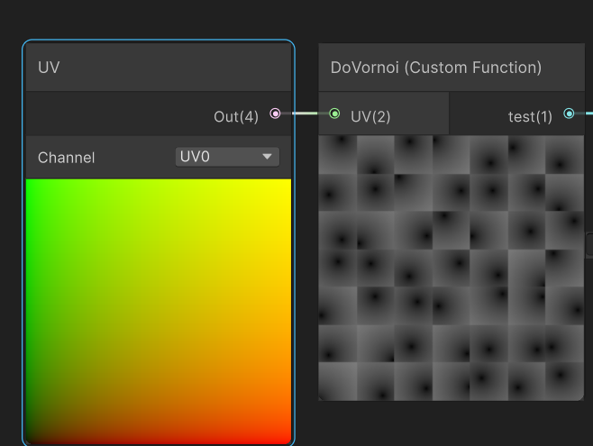
So yeah by the logic described above we would basically get black dots and very white backgrounds but because we invert it by dividing it by 1 before we saturate we get white dots.
Ofcorse it is important to note that this value in this scenario comes from an earlier calculation we did where we took the distance from our featureUV where we basically took the random point declared in the cell and determined a distance from the outer edge of the cell but we'll go more in depth later. 

Anyway now that we have that we have our perfectly clean voronoi basis!

So first lets disect the code and I'll keep repeating it until I understand it exactly!
```hlsl
void DoVornoi_float(float2 UV, out float test)
{
    float scale = 7.0;

    float2 gridUV = UV * scale;

    float2 cell = floor(gridUV);

    float2 featurePoint = hash2(cell);
    float2 featureUV = (cell + featurePoint) / scale;

    test = distance(UV, featureUV);
}

```

So we scale up our UV and floor it down to create a 7x7 grid with each part of the grid identifyable with a coordinate thanks to floor!
Now we determine our feature points and honestly here we go again because I have no clue how a float2 can hold multiple featurepoints and how my random has2 can just go through and determine a point for each....

Alright so first off all we decided with floor that there are now clear coordinates? Remember that dot product??? Well we take the dot product of the coordinate and some random values and then run our randomness to determine a random 


